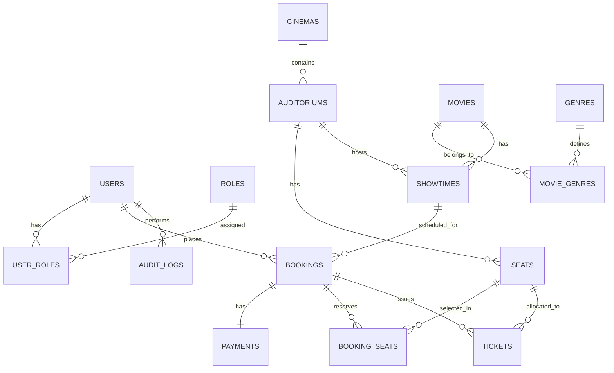

# Thiết kế Cơ sở Dữ liệu - CineGo Movie Ticket Booking System

Tài liệu này trình bày thiết kế chi tiết cơ sở dữ liệu MySQL cho hệ thống đặt vé xem phim trực tuyến **CineGo**. Thiết kế đảm bảo tính nhất quán dữ liệu, hiệu năng truy vấn và ngăn chặn hoàn toàn việc đặt trùng ghế.

---

## 1. Sơ đồ Thực thể Liên kết (ERD - Mermaid Diagram)



---

## 2. Chi tiết các Bảng dữ liệu (Table Details)

### 2.1 Nhóm Xác thực & Người dùng

#### Bảng `users` (Quản lý người dùng)
| Tên cột | Kiểu dữ liệu | Ràng buộc | Mô tả |
| :--- | :--- | :--- | :--- |
| `id` | `BIGINT` | PRIMARY KEY, AUTO_INCREMENT | ID người dùng |
| `username` | `VARCHAR(50)` | UNIQUE, NOT NULL | Tên đăng nhập |
| `password` | `VARCHAR(255)` | NOT NULL | Mật khẩu mã hóa (BCrypt) |
| `email` | `VARCHAR(100)` | UNIQUE, NOT NULL | Email liên hệ |
| `full_name` | `VARCHAR(100)` | NOT NULL | Họ và tên |
| `phone_number` | `VARCHAR(15)` | | Số điện thoại |
| `status` | `VARCHAR(20)` | DEFAULT 'ACTIVE' | Trạng thái (ACTIVE, LOCKED) |
| `created_at` | `TIMESTAMP` | DEFAULT CURRENT_TIMESTAMP | Thời điểm tạo tài khoản |
| `updated_at` | `TIMESTAMP` | ON UPDATE CURRENT_TIMESTAMP | Thời điểm cập nhật cuối |

#### Bảng `roles` (Quản lý vai trò)
| Tên cột | Kiểu dữ liệu | Ràng buộc | Mô tả |
| :--- | :--- | :--- | :--- |
| `id` | `BIGINT` | PRIMARY KEY, AUTO_INCREMENT | ID vai trò |
| `name` | `VARCHAR(20)` | UNIQUE, NOT NULL | Tên vai trò (ROLE_CUSTOMER, ROLE_STAFF, ROLE_ADMIN) |
| `description` | `VARCHAR(255)` | | Mô tả chức năng vai trò |

#### Bảng `user_roles` (Bảng trung gian N-N giữa users và roles)
| Tên cột | Kiểu dữ liệu | Ràng buộc | Mô tả |
| :--- | :--- | :--- | :--- |
| `user_id` | `BIGINT` | FOREIGN KEY -> `users(id)` | Khóa ngoại trỏ đến users |
| `role_id` | `BIGINT` | FOREIGN KEY -> `roles(id)` | Khóa ngoại trỏ đến roles |
| **PRIMARY KEY** | `(user_id, role_id)` | | Khóa chính phức hợp |

---

### 2.2 Nhóm Phim & Thể loại

#### Bảng `movies` (Danh sách phim)
| Tên cột | Kiểu dữ liệu | Ràng buộc | Mô tả |
| :--- | :--- | :--- | :--- |
| `id` | `BIGINT` | PRIMARY KEY, AUTO_INCREMENT | ID phim |
| `title` | `VARCHAR(255)` | NOT NULL | Tên phim |
| `description` | `TEXT` | | Tóm tắt nội dung phim |
| `duration` | `INT` | NOT NULL | Thời lượng phim (phút) |
| `director` | `VARCHAR(100)` | | Đạo diễn |
| `cast` | `VARCHAR(255)` | | Dàn diễn viên chính |
| `release_date` | `DATE` | | Ngày khởi chiếu |
| `language` | `VARCHAR(50)` | | Ngôn ngữ phim |
| `rated` | `VARCHAR(10)` | | Phân loại độ tuổi (T13, T16, T18, P, K) |
| `poster_url` | `VARCHAR(512)` | | Link ảnh poster phim |
| `trailer_url` | `VARCHAR(512)` | | Link video trailer |
| `status` | `VARCHAR(20)` | DEFAULT 'NOW_SHOWING' | Trạng thái (NOW_SHOWING, COMING_SOON, ENDED) |

#### Bảng `genres` (Danh sách thể loại phim)
| Tên cột | Kiểu dữ liệu | Ràng buộc | Mô tả |
| :--- | :--- | :--- | :--- |
| `id` | `BIGINT` | PRIMARY KEY, AUTO_INCREMENT | ID thể loại |
| `name` | `VARCHAR(50)` | UNIQUE, NOT NULL | Tên thể loại (Hành động, Hài, Tình cảm...) |

#### Bảng `movie_genres` (Bảng trung gian N-N giữa movies và genres)
| Tên cột | Kiểu dữ liệu | Ràng buộc | Mô tả |
| :--- | :--- | :--- | :--- |
| `movie_id` | `BIGINT` | FOREIGN KEY -> `movies(id)` | Khóa ngoại trỏ đến movies |
| `genre_id` | `BIGINT` | FOREIGN KEY -> `genres(id)` | Khóa ngoại trỏ đến genres |
| **PRIMARY KEY** | `(movie_id, genre_id)` | | Khóa chính phức hợp |

---

### 2.3 Nhóm Rạp, Phòng chiếu & Ghế tĩnh

#### Bảng `cinemas` (Hệ thống rạp chiếu)
| Tên cột | Kiểu dữ liệu | Ràng buộc | Mô tả |
| :--- | :--- | :--- | :--- |
| `id` | `BIGINT` | PRIMARY KEY, AUTO_INCREMENT | ID rạp |
| `name` | `VARCHAR(100)` | NOT NULL | Tên rạp (CineGo Hùng Vương, CineGo Landmark...) |
| `address` | `VARCHAR(255)` | NOT NULL | Địa chỉ rạp |
| `hotline` | `VARCHAR(15)` | | Số điện thoại liên hệ của rạp |

#### Bảng `auditoriums` (Phòng chiếu thuộc rạp)
| Tên cột | Kiểu dữ liệu | Ràng buộc | Mô tả |
| :--- | :--- | :--- | :--- |
| `id` | `BIGINT` | PRIMARY KEY, AUTO_INCREMENT | ID phòng chiếu |
| `cinema_id` | `BIGINT` | FOREIGN KEY -> `cinemas(id)` | Khóa ngoại trỏ đến rạp |
| `name` | `VARCHAR(50)` | NOT NULL | Tên phòng (Phòng số 1, Phòng IMAX...) |
| `total_seats` | `INT` | NOT NULL | Tổng số ghế được thiết lập |
| `status` | `VARCHAR(20)` | DEFAULT 'ACTIVE' | Trạng thái (ACTIVE, MAINTENANCE) |

#### Bảng `seats` (Ghế tĩnh cấu hình trong phòng)
| Tên cột | Kiểu dữ liệu | Ràng buộc | Mô tả |
| :--- | :--- | :--- | :--- |
| `id` | `BIGINT` | PRIMARY KEY, AUTO_INCREMENT | ID ghế |
| `auditorium_id` | `BIGINT` | FOREIGN KEY -> `auditoriums(id)` | Khóa ngoại trỏ đến phòng chiếu |
| `row_name` | `VARCHAR(2)` | NOT NULL | Tên hàng ghế (A, B, C...) |
| `seat_number` | `INT` | NOT NULL | Số ghế trong hàng (1, 2, 3...) |
| `type` | `VARCHAR(20)` | DEFAULT 'STANDARD' | Loại ghế (STANDARD, VIP, COUPLE) |

---

### 2.4 Nhóm Suất chiếu & Đặt vé (Nghiệp vụ Động)

#### Bảng `showtimes` (Lịch chiếu phim cụ thể)
| Tên cột | Kiểu dữ liệu | Ràng buộc | Mô tả |
| :--- | :--- | :--- | :--- |
| `id` | `BIGINT` | PRIMARY KEY, AUTO_INCREMENT | ID suất chiếu |
| `movie_id` | `BIGINT` | FOREIGN KEY -> `movies(id)` | Phim được chiếu |
| `auditorium_id` | `BIGINT` | FOREIGN KEY -> `auditoriums(id)` | Phòng diễn ra suất chiếu |
| `start_time` | `DATETIME` | NOT NULL | Thời gian bắt đầu suất chiếu |
| `end_time` | `DATETIME` | NOT NULL | Thời gian kết thúc (start_time + duration + clean_time) |
| `base_price` | `DECIMAL(10,2)` | NOT NULL | Giá vé cơ bản cho suất chiếu |
| `status` | `VARCHAR(20)` | DEFAULT 'ACTIVE' | Trạng thái (ACTIVE, CANCELLED, ENDED) |

#### Bảng `bookings` (Đơn đặt vé tổng)
| Tên cột | Kiểu dữ liệu | Ràng buộc | Mô tả |
| :--- | :--- | :--- | :--- |
| `id` | `BIGINT` | PRIMARY KEY, AUTO_INCREMENT | ID đơn hàng |
| `user_id` | `BIGINT` | FOREIGN KEY -> `users(id)` | Khách hàng đặt vé |
| `showtime_id` | `BIGINT` | FOREIGN KEY -> `showtimes(id)` | Suất chiếu đã chọn |
| `total_amount` | `DECIMAL(10,2)` | NOT NULL | Tổng tiền thanh toán |
| `status` | `VARCHAR(20)` | DEFAULT 'PENDING' | Trạng thái (PENDING, PAID, CANCELLED, EXPIRED) |
| `created_at` | `TIMESTAMP` | DEFAULT CURRENT_TIMESTAMP | Thời điểm tạo đơn hàng |
| `expires_at` | `TIMESTAMP` | NOT NULL | Thời điểm hết hạn giữ ghế (ví dụ: created_at + 10 phút) |

#### Bảng `booking_seats` (Các ghế được giữ/đặt trong đơn hàng)
| Tên cột | Kiểu dữ liệu | Ràng buộc | Mô tả |
| :--- | :--- | :--- | :--- |
| `id` | `BIGINT` | PRIMARY KEY, AUTO_INCREMENT | ID chi tiết đặt ghế |
| `booking_id` | `BIGINT` | FOREIGN KEY -> `bookings(id)` | Khóa ngoại trỏ đến đơn đặt vé |
| `seat_id` | `BIGINT` | FOREIGN KEY -> `seats(id)` | Khóa ngoại trỏ đến ghế tĩnh |
| `price` | `DECIMAL(10,2)` | NOT NULL | Giá thực tế của ghế này (base_price + phụ thu loại ghế) |

#### Bảng `tickets` (Vé điện tử cấp sau khi thanh toán)
| Tên cột | Kiểu dữ liệu | Ràng buộc | Mô tả |
| :--- | :--- | :--- | :--- |
| `id` | `BIGINT` | PRIMARY KEY, AUTO_INCREMENT | ID vé |
| `ticket_code` | `VARCHAR(50)` | UNIQUE, NOT NULL | Mã vé duy nhất gửi cho khách (chuỗi ngẫu nhiên viết hoa) |
| `booking_id` | `BIGINT` | FOREIGN KEY -> `bookings(id)` | Liên kết đơn hàng gốc |
| `seat_id` | `BIGINT` | FOREIGN KEY -> `seats(id)` | Ghế tương ứng |
| `showtime_id` | `BIGINT` | FOREIGN KEY -> `showtimes(id)` | Suất chiếu tương ứng |
| `status` | `VARCHAR(20)` | DEFAULT 'ACTIVE' | Trạng thái vé (ACTIVE, CHECKED_IN, EXPIRED) |
| `checked_in_at`| `DATETIME` | | Thời điểm nhân viên soát vé quét |

---

### 2.5 Nhóm Thanh toán & Audit Log

#### Bảng `payments` (Lịch sử giao dịch thanh toán)
| Tên cột | Kiểu dữ liệu | Ràng buộc | Mô tả |
| :--- | :--- | :--- | :--- |
| `id` | `BIGINT` | PRIMARY KEY, AUTO_INCREMENT | ID thanh toán |
| `booking_id` | `BIGINT` | FOREIGN KEY -> `bookings(id)` | Liên kết đơn đặt vé |
| `transaction_no`| `VARCHAR(100)` | UNIQUE | Mã giao dịch ngân hàng / cổng thanh toán mô phỏng |
| `payment_method`| `VARCHAR(50)` | NOT NULL | Phương thức thanh toán (CREDIT_CARD, E_WALLET) |
| `amount` | `DECIMAL(10,2)` | NOT NULL | Số tiền giao dịch thực tế |
| `status` | `VARCHAR(20)` | DEFAULT 'SUCCESS' | Trạng thái thanh toán (SUCCESS, FAILED) |
| `payment_time` | `TIMESTAMP` | DEFAULT CURRENT_TIMESTAMP | Thời điểm thanh toán thành công |

#### Bảng `audit_logs` (Nhật ký thao tác hệ thống)
| Tên cột | Kiểu dữ liệu | Ràng buộc | Mô tả |
| :--- | :--- | :--- | :--- |
| `id` | `BIGINT` | PRIMARY KEY, AUTO_INCREMENT | ID log |
| `user_id` | `BIGINT` | FOREIGN KEY -> `users(id)` | Người thực hiện hành động |
| `action` | `VARCHAR(100)` | NOT NULL | Tên hành động (CREATE_MOVIE, DELETE_USER...) |
| `details` | `TEXT` | | Chi tiết thao tác (dạng JSON cũ/mới nếu cần) |
| `ip_address` | `VARCHAR(45)` | | Địa chỉ IP của máy thao tác |
| `created_at` | `TIMESTAMP` | DEFAULT CURRENT_TIMESTAMP | Thời điểm ghi log |

---

## 3. Các ràng buộc Độc nhất quan trọng (Critical Constraints)

Để đảm bảo tuyệt đối không xảy ra trùng lặp ghế đặt và các lỗi dữ liệu khác:

### A. Chống đặt trùng ghế ở mức database
Chúng ta tạo một ràng buộc unique phức hợp (**Unique Constraint**) trên bảng `tickets` hoặc bảng `booking_seats` ở các đơn hàng có trạng thái thành công:
Tuy nhiên, cách sạch sẽ và triệt để nhất là thiết lập Unique Constraint trên bảng `tickets` cho cặp `(showtime_id, seat_id)`.
* **Constraint SQL**:
  ```sql
  ALTER TABLE tickets ADD CONSTRAINT uq_showtime_seat UNIQUE (showtime_id, seat_id);
  ```
* **Lý do**: Khi thanh toán thành công, hệ thống sẽ chèn bản ghi vào bảng `tickets`. Nếu ghế `seat_id` đã có vé được tạo cho suất chiếu `showtime_id`, MySQL sẽ lập tức từ chối chèn bản ghi mới và rollback toàn bộ transaction thanh toán. Điều này đảm bảo an toàn tuyệt đối ngay cả khi logic kiểm tra ở Service bị vượt qua do quá tải.

### B. Chống tạo trùng cấu hình ghế tĩnh trong phòng chiếu
* **Constraint SQL**:
  ```sql
  ALTER TABLE seats ADD CONSTRAINT uq_auditorium_row_seat UNIQUE (auditorium_id, row_name, seat_number);
  ```
* **Lý do**: Đảm bảo không thể tạo ra hai ghế có cùng vị trí hàng và số trong một phòng chiếu.
