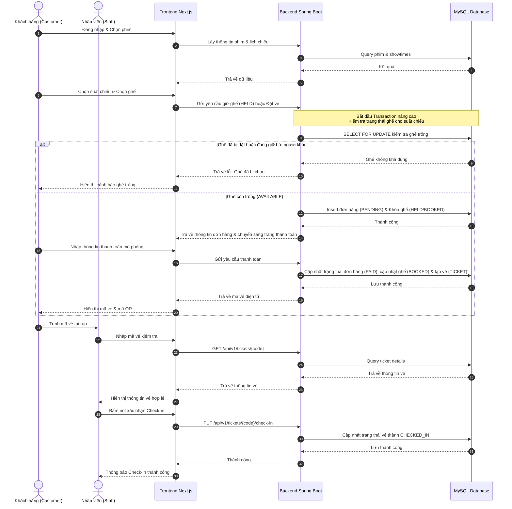

# Tài liệu Phân tích Nghiệp vụ - CineGo Movie Ticket Booking System

Tài liệu này phân tích chi tiết các yêu cầu nghiệp vụ, luồng xử lý chính và kiến trúc tổng thể của hệ thống đặt vé xem phim trực tuyến **CineGo**. Đây là cơ sở định hình quá trình phát triển của nhóm 2 thành viên.

---

## 1. Mục tiêu Dự án
Xây dựng một nền tảng thương mại điện tử chuyên biệt cho phép:
* **Khách hàng (CUSTOMER)**: Trải nghiệm xem phim, lịch chiếu, sơ đồ ghế động trực quan, đặt vé và nhận vé điện tử kèm mã kiểm tra (QR code) qua giao diện web hiện đại, hỗ trợ song song hai chế độ Sáng/Tối.
* **Nhân viên (STAFF)**: Kiểm tra mã vé và check-in cho khách hàng trực tiếp tại rạp nhanh chóng.
* **Quản trị viên (ADMIN)**: Quản lý tập trung toàn bộ tài nguyên của rạp (phim, thể loại, rạp, phòng chiếu, suất chiếu, ghế, người dùng, giao dịch) và theo dõi báo cáo doanh thu cơ bản.

---

## 2. Phạm vi Phiên bản MVP (Phiên bản đầu tiên)
MVP tập trung vào các chức năng cốt lõi để đảm bảo hệ thống vận hành trơn tru:
* **Xác thực và Phân quyền**: Đăng ký, đăng nhập tài khoản. Phân quyền chặt chẽ 3 vai trò: `CUSTOMER`, `STAFF`, `ADMIN` trên cả API Backend và định tuyến Frontend.
* **Quản trị Danh mục (ADMIN)**: Thêm, sửa, xóa Phim, Thể loại, Rạp, Phòng chiếu, Ghế, Suất chiếu, Vé.
* **Quy trình Đặt vé (CUSTOMER)**: Xem danh sách phim đang chiếu/sắp chiếu → Xem chi tiết phim → Chọn suất chiếu → Sơ đồ chọn ghế động → Tạo đơn đặt vé → Thanh toán mô phỏng → Nhận mã vé.
* **Quản lý lịch sử (CUSTOMER)**: Khách hàng xem danh sách vé đã đặt và trạng thái.
* **Soát vé (STAFF)**: Tìm kiếm vé theo mã và xác nhận check-in.
* **Thống kê cơ bản (ADMIN)**: Báo cáo doanh thu theo phim, suất chiếu, rạp.

*Các tính năng như thanh toán thực (VNPAY/Momo), combo đồ ăn, tích lũy điểm VIP, hoàn tiền, gợi ý phim bằng AI và thông báo thời gian thực qua WebSocket sẽ được tạm hoãn sang giai đoạn sau.*

---

## 3. Vai trò Người dùng (User Roles)

### CUSTOMER - Khách hàng
* Đăng ký tài khoản và đăng nhập hệ thống.
* Tìm kiếm phim theo tên, thể loại, trạng thái chiếu.
* Xem chi tiết thông tin phim (đạo diễn, diễn viên, thời lượng, tóm tắt, trailer).
* Xem lịch chiếu phim theo ngày và rạp.
* Chọn suất chiếu phù hợp.
* Xem sơ đồ phòng chiếu với trạng thái ghế được cập nhật động theo suất chiếu đã chọn.
* Chọn ghế (hệ thống cho phép chọn nhiều ghế trong một lần đặt).
* Xác nhận thông tin đặt vé và thực hiện thanh toán mô phỏng (nhập thẻ giả định).
* Nhận mã vé duy nhất sau khi thanh toán thành công.
* Xem lịch sử giao dịch và danh sách vé đã mua.

### STAFF - Nhân viên rạp
* Đăng nhập hệ thống bằng tài khoản được Admin cấp.
* Tìm kiếm vé xem phim của khách hàng dựa trên mã vé.
* Kiểm tra thông tin vé (tên phim, suất chiếu, số ghế, trạng thái thanh toán).
* Xác nhận check-in (cập nhật trạng thái vé thành `CHECKED_IN`) khi khách hàng vào phòng chiếu.

### ADMIN - Quản trị viên
* Quản lý phim (tên phim, mô tả, thời lượng, đạo diễn, ngày khởi chiếu, poster, trailer, trạng thái).
* Quản lý thể loại phim và liên kết phim - thể loại.
* Quản lý hệ thống rạp (tên rạp, địa chỉ, hotline) và phòng chiếu thuộc từng rạp.
* Quản lý cấu hình ghế trong phòng chiếu (số hàng, số cột, loại ghế: THƯỜNG, VIP, đôi - COUPLE).
* Quản lý suất chiếu (liên kết phim, phòng chiếu, thời gian bắt đầu, giá vé cơ bản).
* Quản lý danh sách đơn đặt vé và giao dịch thanh toán.
* Quản lý tài khoản người dùng và phân quyền hệ thống (`CUSTOMER`, `STAFF`, `ADMIN`).
* Xem thống kê doanh thu và lượng vé bán ra qua Dashboard.

---

## 4. Quy trình Nghiệp vụ chính: Đặt vé và Soát vé



### Các trạng thái của Đơn đặt vé (Booking Status)
1. **PENDING**: Khách hàng đang trong quá trình đặt và chờ thanh toán (giữ ghế tạm thời).
2. **PAID**: Giao dịch thanh toán mô phỏng thành công, vé được tạo chính thức.
3. **CANCELLED**: Đơn đặt vé bị hủy chủ động bởi khách hàng hoặc admin.
4. **EXPIRED**: Đơn đặt vé quá thời gian thanh toán quy định (ví dụ sau 10 phút) mà không thanh toán. Ghế sẽ tự động được giải phóng.
5. **CHECKED_IN**: Khách hàng đã được nhân viên rạp soát vé thành công khi vào phòng chiếu.

### Các trạng thái của Ghế trong từng Suất chiếu (Seat Status for Showtime)
Vì trạng thái ghế thay đổi theo từng suất chiếu, hệ thống sử dụng các trạng thái sau để theo dõi:
1. **AVAILABLE**: Ghế còn trống, khách hàng có thể chọn.
2. **HELD**: Ghế đang được chọn bởi một khách hàng khác và trong thời gian chờ thanh toán (khóa tạm thời).
3. **BOOKED**: Ghế đã được thanh toán thành công và không thể chọn nữa.

---

## 5. Nghiệp vụ Quan trọng & Giải pháp Kỹ thuật

### A. Kiểm tra Trùng Lịch Chiếu (Showtime Scheduling)
* **Vấn đề**: Không cho phép xếp 2 suất chiếu trùng hoặc chồng chéo thời gian trong cùng một phòng chiếu.
* **Yêu cầu tính toán**:
  - Thời gian của một suất chiếu gồm: `Thời gian bắt đầu (startTime)` + `Thời lượng phim (duration)` + `Thời gian dọn dẹp/nghỉ giữa các suất (cleaningTime, ví dụ 15 phút)`.
  - Suất chiếu mới `S_new` có khoảng thời gian `[Start_new, End_new]`.
  - Suất chiếu đã tồn tại `S_exist` trong phòng chiếu đó có khoảng thời gian `[Start_exist, End_exist]`.
  - Điều kiện bị trùng: `Start_new < End_exist` VÀ `End_new > Start_exist`.
* **Giải pháp**:
  - Ở tầng Service của backend, trước khi lưu suất chiếu, thực hiện một câu truy vấn JPA tìm kiếm các suất chiếu trong cùng phòng chiếu có khoảng thời gian giao nhau với suất chiếu đề xuất.
  - Sử dụng database lock hoặc transaction phù hợp để tránh tình trạng hai admin tạo suất chiếu trùng nhau đồng thời.

### B. Chống Đặt Trùng Ghế (Double Booking Prevention)
* **Vấn đề**: Tránh tình trạng hai khách hàng cùng chọn một ghế và thanh toán thành công cho cùng một suất chiếu tại cùng một thời điểm.
* **Giải pháp đề xuất**:
  1. **Tầng Database (Unique Constraint)**:
     - Tạo một bảng trung gian hoặc bảng chi tiết vé/ghế đã đặt (ví dụ `booking_seats` hoặc `tickets`) có thiết lập khóa duy nhất (**Unique Key**) kết hợp giữa `(showtime_id, seat_id)`.
     - Nếu có 2 transaction cùng cố gắng chèn dữ liệu cho cùng một ghế ở cùng một suất chiếu, database sẽ chặn giao dịch thứ hai và ném ra lỗi `ConstraintViolationException`.
  2. **Tầng Service (Pessimistic Locking)**:
     - Khi kiểm tra trạng thái ghế trước khi chèn đơn hàng, sử dụng cơ chế khóa bi quan (**Pessimistic Write Lock**):
       `SELECT ... FOR UPDATE` trên các ghế được chọn cho suất chiếu đó.
     - Điều này đảm bảo các yêu cầu đặt ghế đồng thời được xếp hàng xử lý tuần tự, ngăn ngừa hiện tượng race condition.
  3. **Quản lý Giữ Ghế Tạm Thời (HELD)**:
     - Giai đoạn đầu chỉ cần chèn bản ghi giữ ghế với trạng thái `PENDING` vào bảng đơn hàng. Nếu sau thời gian quy định (ví dụ 10 phút) đơn hàng chưa thanh toán, một tác vụ nền (Scheduled Task) sẽ quét và cập nhật trạng thái đơn hàng thành `EXPIRED` để giải phóng ghế.

---

## 6. Kiến trúc Hệ thống Tổng thể

```text
┌─────────────────────────────────────────────────────────┐
│                    Next.js Frontend                     │
│      (Customer Web, Staff Check-in, Admin Panel)       │
└────────────────────────────┬────────────────────────────┘
                             │ REST API (JSON)
                             ▼
┌─────────────────────────────────────────────────────────┐
│                Spring Boot REST Backend                 │
│                                                         │
│  ┌──────────────────────┐     ┌──────────────────────┐  │
│  │  Controller / Router │     │   Spring Security    │  │
│  └──────────┬───────────┘     └──────────┬───────────┘  │
│             │                            │              │
│             ▼                            ▼              │
│  ┌───────────────────────────────────────────────────┐  │
│  │             Service Layer (Logic Nghiệp Vụ)       │  │
│  │           (Transactions, Concurrency Lock)        │  │
│  └──────────┬────────────────────────────┬───────────┘  │
│             │                            │              │
│             ▼                            ▼              │
│  ┌──────────────────────┐     ┌──────────────────────┐  │
│  │  Spring Data JPA     │     │   Hibernate ORM      │  │
│  └──────────┬───────────┘     └──────────┬───────────┘  │
└─────────────┼────────────────────────────┼──────────────┘
              │                            │
              └──────────────┬─────────────┘
                             ▼
┌─────────────────────────────────────────────────────────┐
│                    MySQL Database                       │
│     (Tables, Indexes, Constraints, InnoDB Engine)       │
└─────────────────────────────────────────────────────────┘
```

Kiến trúc phân tầng sạch sẽ giúp mã nguồn dễ bảo trì, dễ kiểm thử và tạo điều kiện phân chia công việc rõ ràng cho cả hai thành viên trong nhóm.
